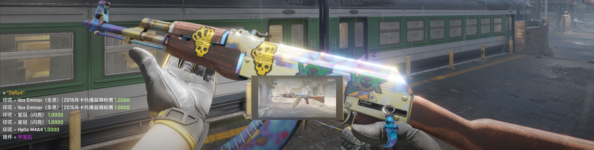

# BuffInspector

🧩 在游戏内解析Buff的分享链接并更换皮肤

## 使用方法

在游戏内聊天框中输入：

```text
!buff <Buff分享链接>
```

## 截图




## 依赖

- [swiftly-solution/swiftlys2](https://github.com/swiftly-solution/swiftlys2)
- [samyycX/WeaponSkins](https://github.com/samyycX/WeaponSkins)

## 许可证

本项目基于 GPL-3.0 许可证开源
